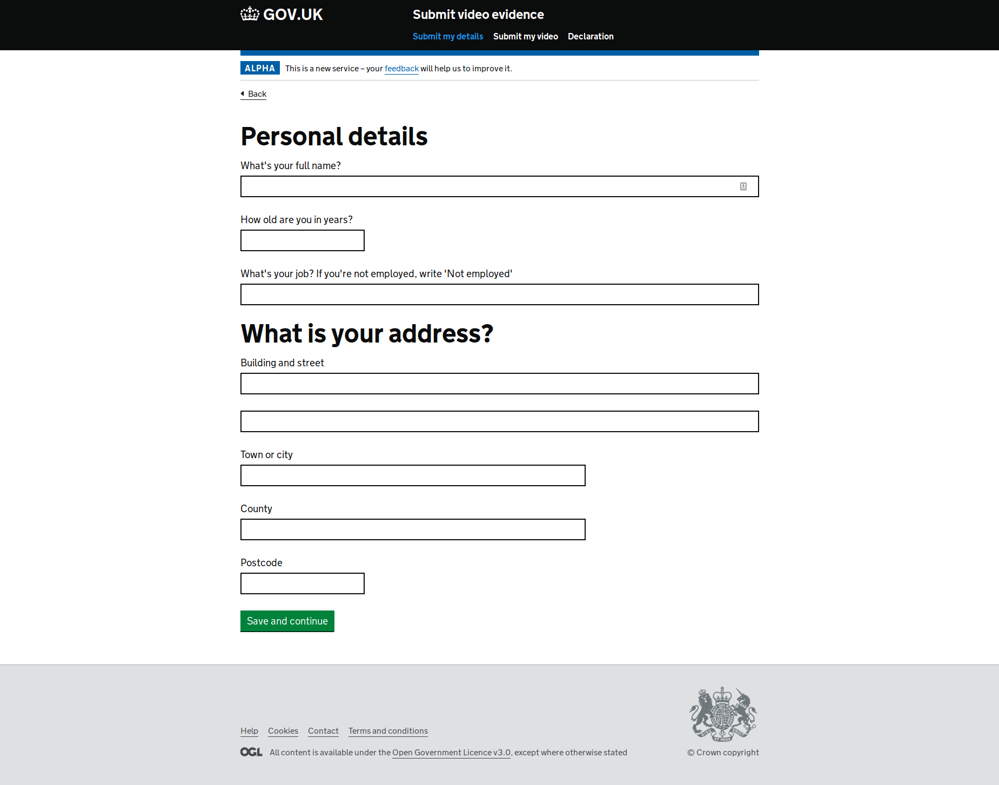
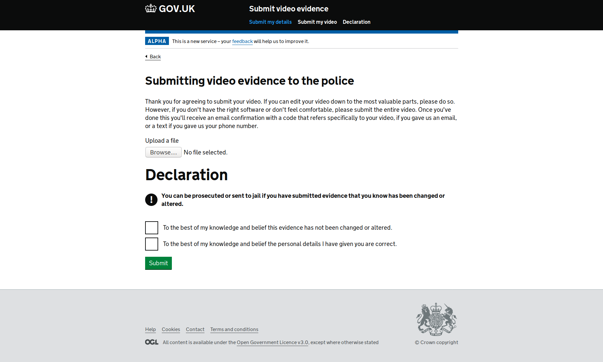

# Submit video evidence

## Context
This prototype came out of Hack the Police 3 in London. Officers told me that it is sometimes difficult to 
get CCTV footage from citizens. This prototype looks at whether a service to receive that evidence asynchronously would
work.

## Aim
- spin up an S3 bucket for each new crime reference (CR) number
- allow user to add evidence, tagging it with information and the appropriate CR number
- sandbox the uploaded file and ensure it's video and not malicious
- In the future, scan the video itself and ensure it's evidence rather than (for example) pornography
- find the bucket for that CR
- add video evidence into this bucket

## Frontend
The frontend is built using the GOV.UK Design System. There is a #TODO to use it properly, since at the moment it just 
has the minified assets.

## Backend
The backend is Flask + Python3. It's a very basic set of routes and I've over-engineered the blueprints. There is some 
code to integrate with Amazon S3, which is the main point of this service. However, the AWS docs are a bit questionable, 
so it's nowhere near as neat as I'd like

## Try it out
- clone this repo
- `cd` into the folder
- make a virtual environment. You should be able to run `python3 -m venv venv`
- activate the environment by typing `source venv/bin/activate`
- install the requirements: `pip install -r requirements.txt`
- run the app: `flask run`

It should look like this:

